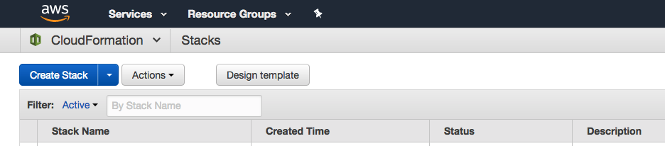

# Resound CloudFormation Template

This [AWS CloudFormation](http://docs.aws.amazon.com/AWSCloudFormation/latest/UserGuide/Welcome.html) template sets up the backend (Resound API) as well as the front-end (Resound Store / Manage) apps under one URL. These two apps are run in the same EC2 instance but listen in on different ports.  Traffic is routed by an Application Load Balancer based on the URL path.  Requests to `/api/*` and `/cable` are routed to Resound API and everything is routed to the client.

## Requirements

The template assumes you already have all of the following set up:
 
* AWS account
* AWS VPC and subnets
* AWS IAM role for Resound's use
* AWS S3 bucket
* Auth0 API & Client
* A database host

## To use the template, update these values
Search for the following terms in the template. You'll see that the associated values are empty.  Insert your intended values in the empty field.

| Name | Description |
| --- | --- |
| `ALLOWED_CORS_URL` | URL where the Resound client app (Store) will reside, without the ending `/`. ie: http://resound-store-demo.scprdev.org |
| `RESOUND_URL` | URL where the Resound client app will reside ie: http://resound-store-demo.scprdev.org/ |
| `RESOUND_API_URL` | URL where the Resound API is, without the ending `/`. Typically, this would be the same as `RESOUND_URL` without the ending `/` |
| `RESOUND_API_CDN` | (optional) Host URL of the CDN that serves the uploaded audio files. IE: "https://resound-store.scpr.org" |
| `DB_USER` | database username |
| `DB_PW` | database password |
| `DB_NAME` | database name to store the tables under ie: resound |
| `DB_HOST` | endpoint or hostname to our database (without the port) |
| `AUTH0_CLIENT_ID` | Client id of the client you created in Auth0 |
| `AUTH0_CALLBACK_URL` | Where the log in page lives. Generally, this will be the same value as RESOUND_URL |
| `AUTH0_DOMAIN` | domain that your Auth0 client is signed up under |
| `AUTH0_AUDIENCE` | identifier value in the Auth0 API |
| `AWS_REGION` | region you want to deploy the containers to. Ie: us-west-2 |
| `AWS_ACCESS_KEY_ID` | access key used in conjunction with secret key to upload audio to AWS S3 |
| `AWS_SECRET_ACCESS_KEY` | secret access key used to upload audio to AWS S3 |
| `AWS_BUCKET` | S3 bucket the audio files should be stored in |
| `SECRET_KEY_BASE` | secret key base value generated by running `rake secret` from the `resound-api` container |
| `TaskRoleArn` | arn to an existing IAM role, ideally for Resound-related tasks |
| `CMS_URL` | (optional) Base URL of the CMS that will be launching Resound. Ie: https://www.scpr.org |

## Deployment

1. Download [resound-template.json](resound-template.json)
1. In the AWS console, go to Services > CloudFormation
1. Click on `Create Stack`
1. Upload the template by clicking on Choose a template > Choose File > point to the file, then click `Next`
1. The rest of the setup is dependent on your AWS needs and not covered by this guide.

## After Deployment

1. SSH into your EC2 instance with the key-pair you specified when deploying the template.
1. Run initial database creation and migration:
    a. SSH into the docker container that is running the `resound-api` image:
        `docker exec -it <container id> bash`
    b. `rake db:create`
    c. `rake db:migrate`
1. (optional) Set up a Route 53 record set pointing to the Application Load Balancer that was created by the CloudFormation
1. Visit the URL set up from the previous step, or the public DNS of the EC2 container
1. If you see a Resound login screen, grab yourself a beer or slice of cake. You earned it!

